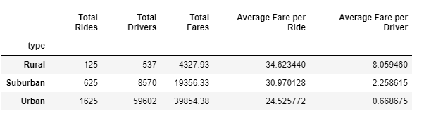
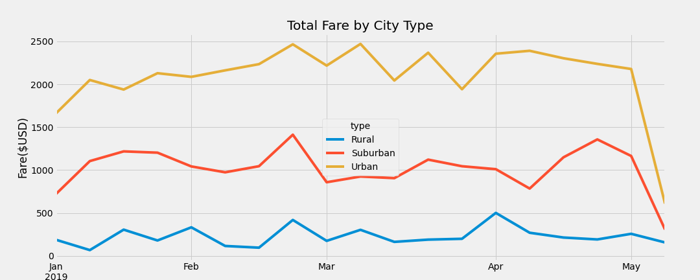

# PyBer_Analysis
---
## Overview
The purpose of this new analysis was to create a summary DataFrame of the ride-sharing data by city type, and use that to create a multiple-line graph that shows the total weekly fares for each city type. Lastly, this report will summarize how the data differs by city type and how those differences can be used by decision-makers at PyBer.

---
## Results
The following DataFrame highlights a few things:
1. Urban areas receive the most rides, while rural areas receive the least.
2. Urban areas also have the most drivers, while rural areas have the least. 
3. Urban areas have the least expensive fare compared to Suburban and Rural areas
4. Urban areas have a higher total fare, since they get more rides even though they are the least expensive. 

The following multi-line chart shows that fare prices vary consistently throughout the year for each city type.

---
## Summary
Based on the results, here's what I would recommend for addressing any disparities among the city types:
1. I'd recommend creating insentives for rural and suburban drivers to join PyBer.
2. Standardize fare based on mileage and time traveled so rural drivers especially don't feel like they're being overcharged. 
3. Standardize pay percenatage so that drivers make a consistent amount, regardless of where they drive. 
